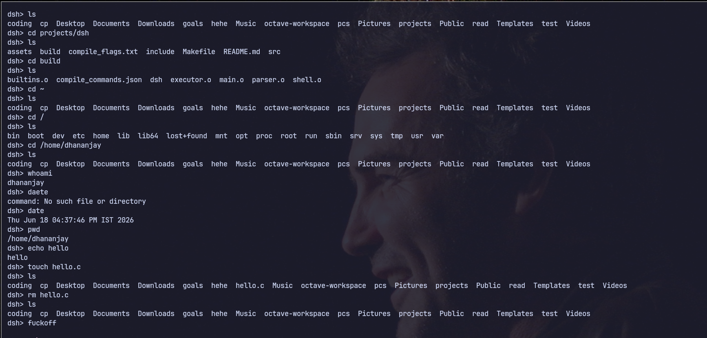

# dsh

A simple UNIX shell written in C.

## Screenshot


## Features

* Execute external programs using `fork()`, `execvp()`, and `waitpid()`
* Parse user input into `argv`
* Builtin commands:

  * `cd`
  * `cd ~`
  * `exit`
  * `fuckoff`

* Basic error handling

## INSTALLATION 

```bash
git clone https://github.com/Dhananjay-Jha-1/dsh.git
```

```bash
cd dsh
```

## Build

```bash
make all
```

## Run

```bash
./build/dsh
```

## Example

```text
dsh> pwd
/home/dhananjay/projects/dsh

dsh> cd build

dsh> pwd
/home/dhananjay/projects/dsh/build

dsh> ls
compile_commands.json dsh executor.o parser.o shell.o

dsh> exit
```

## Project Structure

```text
src/
├── main.c
├── shell.c
├── parser.c
├── executor.c
└── builtins.c

include/
├── shell.h
├── parser.h
├── executor.h
└── builtins.h
```

## Current Limitations

* No pipes (`|`)
* No redirection (`>`, `<`)
* No command history
* No tab completion
* No environment variable expansion
* No quote handling

## Roadmap

* [ ] Pipes
* [ ] Redirection
* [ ] Command history
* [ ] Environment variable expansion
* [ ] Quote handling
* [ ] Tab completion

## Release

Current version : v0.0.1

See all releases : 
https://github.com/Dhananjay-Jha-1/dsh/releases
